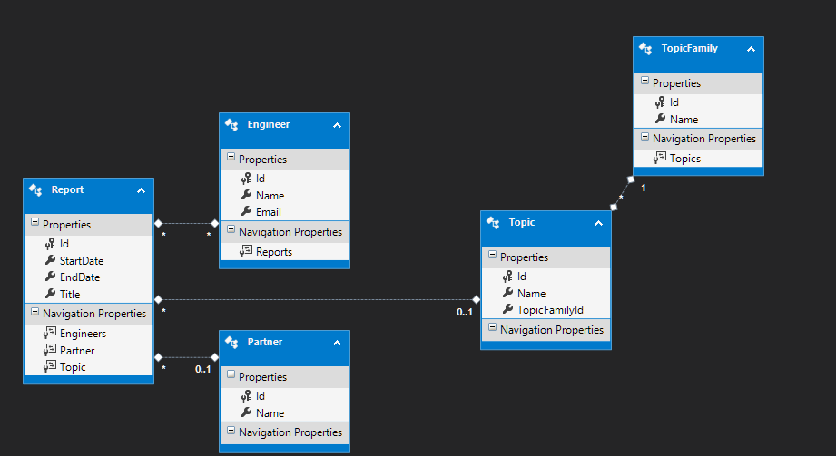
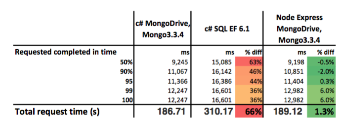

# Mongo SQL comparison - work in progress!!!
* A quick ongoing proof of concept to play with the c# driver for Mongo and contrast it with EF.
* EF integration per [Pluralsight course on EF6] (https://app.pluralsight.com/library/courses/entity-framework-6-getting-started/table-of-contents]. Remember to install (the tools)[http://thedatafarm.com/data-access/installing-ef-power-tools-into-vs2015/)

# Details of the test
## Biz problem
* 5000 Reports elements in SQL database and mongo database deployed in azure VM (same budget ot make comparison).
* Reports has many engineers (up to 4)
* Find reports by engineer's name

## Technologies
* C# API restful project EF + MongoDriver - deployed form Visual Studio
* Node express server with MongoDriver - deployed with Azure, git webhook.

* Ubuntu 16.04 with Mongo 3.3.4 (needed for aggregation lookups without the unwind - see) A0, ~13 $ / month.
* S0 SQL Database ~ 15 $ / month

# Results

Load test with npm (loadtest)[https://www.npmjs.com/package/loadtest]

## mongo on c#/ MongoDriver 
loadtest -n 80 -c 4 http://dbperformance112.azurewebsites.net/api/mongo/reportsbyengineername?engineerName=Rudolph64
Target URL:          http://dbperformance112.azurewebsites.net/api/mongo/reportsbyengineername?engineerName=Rudolph64
Max requests:        80
Concurrency level:   4
Agent:               none

Completed requests:  80
Total errors:        0
Total time:          186.709215061 s
Requests per second: 0
Total time:          186.709215061 s

Percentage of the requests served within a certain time
 50%      9245 ms
 90%      11067 ms
 95%      11366 ms
 99%      12247 ms
100%      12247 ms (longest request)

## SQL on C#/ EF 
* loadtest -n 80 -c 4 http://dbperformance112.azurewebsites.net/api/sql/reportsbyengineername?engineerName=Rudolph64
Target URL:          http://dbperformance112.azurewebsites.net/api/sql/reportsbyengineername?engineerName=Rudolph64
Max requests:        80
Concurrency level:   4
Agent:               none

Completed requests:  80
Total errors:        0
Total time:          310.170949723 s
Requests per second: 0
Total time:          310.170949723 s

Percentage of the requests served within a certain time
 50%      15085 ms
 90%      16142 ms
 95%      16386 ms
 99%      16601 ms
100%      16601 ms (longest request)

## Mongo on Node
loadtest -n 80 -c 4 http://dbperfmongo2.azurewebsites.net/api/mongo/reportsbyengineername/Rudolph64
Target URL:          http://dbperfmongo2.azurewebsites.net/api/mongo/reportsbyengineername/Rudolph64
Max requests:        80
Concurrency level:   4
Agent:               none

Completed requests:  80
Total errors:        0
Total time:          189.118719374 s
Requests per second: 0
Total time:          189.118719374 s

Percentage of the requests served within a certain time
 50%      9198 ms
 90%      10851 ms
 95%      11404 ms
 99%      12982 ms
100%      12982 ms (longest request)
